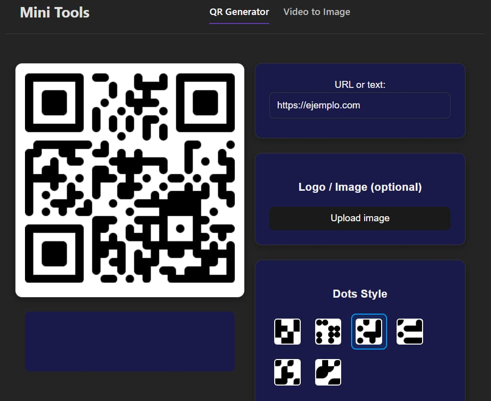

# Mini Tools - Una Colección de Utilidades Web



**Mini Tools** es una aplicación web construida con Preact y Vite que ofrece una suite de herramientas pequeñas y eficientes para tareas cotidianas. Actualmente, la aplicación incluye un potente **Generador de Códigos QR** y un versátil **Extractor de Imágenes y GIF de Video**.

## 🛠️ Herramientas Disponibles

### ✨ Generador de Códigos QR

Crea códigos QR únicos y atractivos con una amplia gama de opciones de personalización:

- **Contenido Personalizable**: Genera códigos QR para URLs, texto, números de teléfono, o cualquier otra información.
- **Estilo de Puntos**: Elige entre diferentes formas para los módulos del QR (cuadrados, puntos, bordes redondeados, etc.).
- **Colores y Degradados**: Selecciona colores sólidos o aplica degradados lineales/radiales para un diseño dinámico.
- **Fondo Personalizable**: Configura un color de fondo sólido o hazlo transparente para superponer el QR en otras imágenes.
- **Logo o Imagen Central**: Añade tu logo o cualquier imagen en el centro del código QR, ajustando su tamaño y margen.
- **Descarga en Múltiples Formatos**: Descarga tu código QR en formatos de alta calidad: **PNG, JPEG, WEBP y SVG**.

### 🎥 Extractor de Imágenes y GIF de Video

Transforma tus videos en fotogramas individuales o GIFs animados con total control:

- **Selección de Rango**: Define con precisión el tiempo de inicio y fin del video para la extracción.
- **Intervalo de Captura**: Configura cada cuántos segundos deseas capturar un fotograma.
- **Generación de GIF**: Crea un GIF animado a partir de los fotogramas extraídos.
- **Ajustes de GIF**: Personaliza la calidad y el retardo entre fotogramas para optimizar el resultado.
- **Previsualización**: Observa una vista previa de los fotogramas que se generarán antes de procesar.
- **¡Próximamente**: Descarga de fotogramas en ZIP y PDF!

## 🚀 Cómo Usarlo

1.  **Clona el repositorio:**
    ```bash
    git clone https://github.com/tu-usuario/mini-tools.git
    cd mini-tools
    ```
2.  **Instala las dependencias:**
    ```bash
    npm install
    ```
3.  **Inicia el servidor de desarrollo:**
    ```bash
    npm run dev
    ```
4.  Abre tu navegador y visita `http://localhost:5173` (o el puerto que indique Vite).

## � Tecnologías Utilizadas

- **Preact**: Una alternativa rápida y ligera a React con la misma API.
- **Vite**: Un entorno de desarrollo de frontend moderno y ultrarrápido.
- **TypeScript**: Para un código más robusto y mantenible.
- **qr-code-styling**: La librería que hace posible la magia de la personalización de los QR.
- **gif.js**: Para la generación de GIFs animados en el navegador.


## 🏷️ SEO y Metadatos

**Meta Título:** Mini Tools - Generador de QR Personalizado, Extractor de GIF y Herramientas Web

**Meta Descripción:** Crea y personaliza códigos QR con logos y colores, o extrae fotogramas de videos para crear GIFs animados. Una suite de herramientas web rápidas y gratuitas para tus necesidades diarias.

**Palabras Clave (Keywords):**
`generador de qr`, `crear código qr`, `qr con logo`, `qr personalizado`, `video a gif`, `extraer fotogramas de video`, `crear gif de video`, `qr online`, `qr gratis`, `qr code generator`, `custom qr code`, `video to gif`, `extract frames from video`, `qr con imagen`, `qr transparente`, `qr svg`, `herramientas web`, `mini tools`, `preact`, `vite`, `utilidades online`
